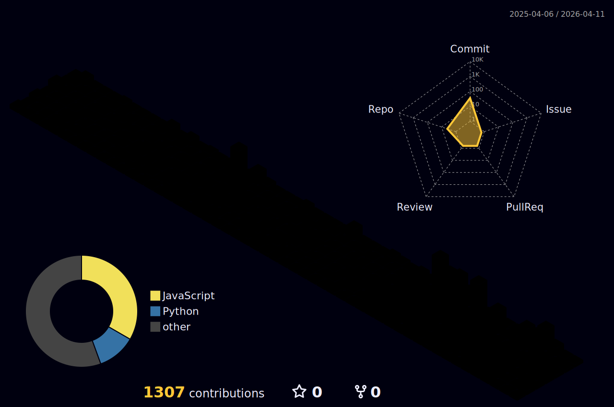

<h1 align="center">Hi 👋, I'm Jessca Bagolor</h1>
<h3 align="center">A passionate full-stack developer from the Philippines</h3>

  

- 🔭 I'm currently working on **Betting Apps**

- 👨‍💻 All of my projects are available at [https://github.com/Jaes0103](https://github.com/Jaes0103)

- 💬 Ask me about **Python, JavaScript, C#, Django, Laravel, NextJS, Dotnet, PERN Stack, ReactJS, Flutter, React Native, Selenium, Playwright**

- 📫 How to reach me **jesscabagolor@gmail.com**

<h3 align="left">Connect with me:</h3>

<h3 align="left">Languages and Tools:</h3>

                   

<h3 align="left">GitHub Stats:</h3>

  

<h3 align="left">Most Used Languages:</h3>

<h3 align="left">3D Contribution Calendar:</h3>

